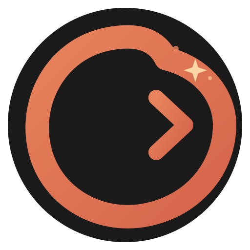
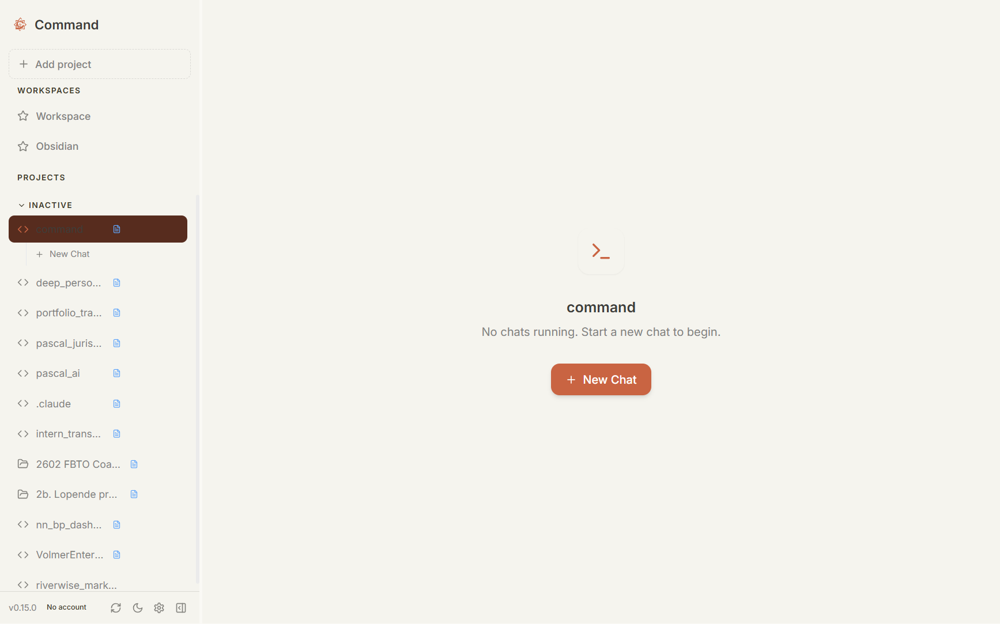

<p align="center">
  
</p>

<h1 align="center">Command</h1>

<p align="center">
  <strong>A modern desktop app for managing multiple Claude Code terminal sessions</strong>
</p>

<p align="center">
  <a href="#features">Features</a> •
  <a href="#installation">Installation</a> •
  <a href="#usage">Usage</a> •
  <a href="#keyboard-shortcuts">Shortcuts</a> •
  <a href="#development">Development</a> •
  <a href="#architecture">Architecture</a>
</p>

<p align="center">
  
  
  
  
  
</p>

---

## Why Command?

**You're deep in flow.** Claude is refactoring your authentication module. Then Slack pings — the payment bug is back. You open another terminal, start Claude on that project. Now you're Alt-Tabbing between six windows, losing context, forgetting which Claude asked you a question three minutes ago.

Sound familiar?

**Command is mission control for Claude Code.**

One window. All your projects in a sidebar. Every terminal visible at a glance. An orange dot tells you exactly which Claude needs your attention. `Ctrl+↑` to switch projects. Done.

It's the difference between juggling and conducting.

<p align="center">
  
</p>

---

## Features

### Multi-Project Management
- Add any folder as a project
- Drag-and-drop to reorder projects
- Up to 3 concurrent terminals per project
- Switch projects instantly with `Ctrl+↑/↓`

### Attention Indicator
- **Orange dot** appears when Claude needs your input
- Never miss a question while working on another project
- See at a glance which sessions are waiting for you

### Integrated Terminal
- Full xterm.js terminal with 256-color support
- Auto-launches `claude` command on terminal creation
- Clickable links in terminal output
- 5000 line scrollback buffer

### File Explorer
- Tree view of project files with syntax-aware icons
- Expandable/collapsible directories
- Respects `.gitignore` patterns
- Quick toggle with `Ctrl+Alt+B`

### Git Integration
- Live git status panel with auto-refresh
- Branch info with ahead/behind indicators
- Staged, modified, and untracked files
- Conflict detection

### Resizable Panels & Themes
- Three-panel layout: Sidebar | Terminals | File Explorer
- Drag to resize, layout persists across sessions
- Dark and light themes with one-click toggle

---

## Installation

**[Download for Windows →](https://github.com/remcovolmer/command/releases)**

Choose the installer (`.exe`) or portable version. That's it.

<details>
<summary>Build from source (for contributors)</summary>

```bash
git clone https://github.com/remcovolmer/command.git
cd command
npm install
npm run rebuild   # Required for node-pty
npm run dev       # Development mode
npm run build     # Production build
```

**Windows:** Requires Visual Studio Build Tools with "Desktop development with C++".

</details>

---

## Usage

### Adding Projects

1. Click **"Add project"** in the sidebar
2. Select a folder containing your code
3. A terminal automatically opens and runs `claude`

### Managing Terminals

- Click the **+** button on a project to add a terminal (max 3)
- Click a terminal tab to switch to it
- Click **×** to close a terminal
- Orange dot indicates the terminal needs input

### File Explorer

- Toggle with the panel icon in sidebar footer or `Ctrl+Alt+B`
- Click folders to expand/collapse
- Git status panel shows changed files

---

## Keyboard Shortcuts

| Shortcut | Action |
|----------|--------|
| `Ctrl + ↑/↓` | Switch between projects |
| `Ctrl + ←/→` | Switch between terminals in current project |
| `Ctrl + T` | Create new terminal in active project |
| `Ctrl + Alt + B` | Toggle file explorer |

---

## Configuration

### Custom Shell

By default, Command uses:
- **Windows:** Git Bash (if installed), otherwise PowerShell
- **macOS/Linux:** Default shell (`$SHELL` or `/bin/bash`)

Override with the `COMMAND_CENTER_SHELL` environment variable:

```bash
# Windows example
set COMMAND_CENTER_SHELL=C:\Windows\System32\cmd.exe

# macOS/Linux example
export COMMAND_CENTER_SHELL=/usr/local/bin/zsh
```

---

## Development

### Commands

```bash
npm run dev      # Start development server with hot reload
npm run build    # Build for production
npm run test     # Run tests
npm run rebuild  # Rebuild native modules (node-pty)
```

### Tech Stack

- **Framework:** Electron 34
- **Frontend:** React 18 + TypeScript
- **Styling:** Tailwind CSS
- **State:** Zustand with persistence
- **Terminal:** xterm.js with node-pty
- **Build:** Vite + electron-builder

---

## Architecture

```
┌─────────────────────────────────────────────────────────────┐
│  Main Process (electron/main/)                              │
│  ├── index.ts         - App lifecycle, IPC handlers         │
│  └── services/                                              │
│      ├── TerminalManager.ts   - PTY spawning via node-pty   │
│      ├── ProjectPersistence.ts - JSON file storage          │
│      └── GitService.ts        - Git status operations       │
└─────────────────────────────────────────────────────────────┘
                    ↕ IPC via contextBridge
┌─────────────────────────────────────────────────────────────┐
│  Renderer (src/)                                            │
│  ├── stores/projectStore.ts   - Zustand state management    │
│  ├── components/                                            │
│  │   ├── Sidebar/             - Project list, drag-drop     │
│  │   ├── Terminal/            - xterm.js integration        │
│  │   ├── FileExplorer/        - File tree, git status       │
│  │   └── Layout/              - Resizable panel layout      │
│  └── utils/                                                 │
│      ├── electron.ts          - API accessor                │
│      └── terminalEvents.ts    - IPC subscription manager    │
└─────────────────────────────────────────────────────────────┘
```

### Directory Structure

```
command/
├── electron/
│   ├── main/                 # Main process
│   │   ├── index.ts          # Entry point, window & IPC
│   │   └── services/         # Terminal, persistence, git
│   └── preload/
│       └── index.ts          # Secure context bridge
├── src/
│   ├── components/
│   │   ├── Layout/           # MainLayout, TerminalArea
│   │   ├── Sidebar/          # Project list with drag-drop
│   │   ├── Terminal/         # xterm.js wrapper
│   │   └── FileExplorer/     # File tree, git panel
│   ├── stores/
│   │   └── projectStore.ts   # Zustand state
│   ├── types/
│   │   └── index.ts          # TypeScript interfaces
│   └── utils/
│       ├── electron.ts       # API helper
│       └── terminalEvents.ts # Event subscriptions
├── build/                    # App icons
└── public/                   # Static assets
```

---

## Data Storage

Command stores data in your system's app data directory:

| Platform | Location |
|----------|----------|
| Windows | `%APPDATA%\command-center\` |
| macOS | `~/Library/Application Support/command-center/` |
| Linux | `~/.config/command-center/` |

**Files:**
- `projects.json` - Project list and metadata
- `config.json` - App settings (layout, theme)

---

## Troubleshooting

### node-pty compilation fails (Windows)

Install Visual Studio Build Tools:
1. Download from [Visual Studio Build Tools](https://visualstudio.microsoft.com/visual-cpp-build-tools/)
2. Select "Desktop development with C++"
3. Run `npm run rebuild`

### Git Bash not detected

Set the shell manually:
```bash
set COMMAND_CENTER_SHELL=C:\Program Files\Git\bin\bash.exe
```

### Terminal not starting claude

Ensure `claude` CLI is installed and in your PATH:
```bash
npm install -g @anthropic-ai/claude-code
```

---

## Contributing

Contributions are welcome! Please:

1. Fork the repository
2. Create a feature branch (`git checkout -b feature/amazing-feature`)
3. Commit your changes (`git commit -m 'Add amazing feature'`)
4. Push to the branch (`git push origin feature/amazing-feature`)
5. Open a Pull Request

---

## License

MIT License - see [LICENSE](LICENSE) for details.

---

## Acknowledgments

- [Claude Code](https://claude.ai/code) by Anthropic
- [Electron](https://www.electronjs.org/)
- [xterm.js](https://xtermjs.org/)
- [node-pty](https://github.com/microsoft/node-pty)

---

<p align="center">
  Built with Claude Code
</p>
