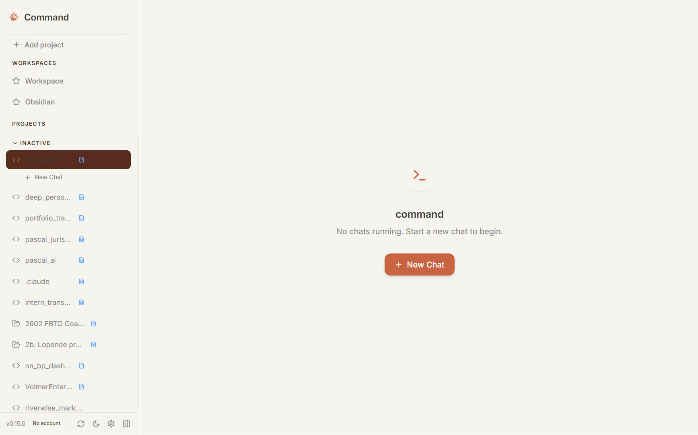

<p align="center">
  
</p>

<h1 align="center">Command</h1>

<p align="center">
  <strong>Mission control for Claude Code</strong>
</p>

<p align="center">
  
  
  
</p>

---

## Why Command?

**You're deep in flow.** Claude is refactoring your authentication module. Then Slack pings — the payment bug is back. You open another terminal, start Claude on that project. Now you're Alt-Tabbing between six windows, losing context, forgetting which Claude asked you a question three minutes ago.

**Command is mission control for Claude Code.** One window. All your projects in a sidebar. Every Claude session visible at a glance. Color-coded attention dots tell you exactly which session needs input. `Ctrl+Arrow` to navigate. Done.

It's the difference between juggling and conducting.

<p align="center">
  
</p>

---

## Features

### Project Management
- **Multi-project sidebar** — All projects in one place with drag-to-reorder
- **Three project tiers** — Workspaces (pinned overview), Projects (standard), and Code (full git integration)
- **Active / Inactive sections** — Projects with running sessions float to the top
- **Context menu** — Open in file explorer, external editor, or GitHub from right-click

### Claude Session Management
- **Up to 10 sessions per project** — Run multiple Claude Code instances side-by-side
- **Live attention indicators** — Colored dots show session state at a glance:
  - Blue = working, Orange = needs input, Green = done, Red = stopped
- **Session resume** — Sessions automatically restore on app restart with full scrollback
- **Auto-naming** — Sessions get descriptive titles based on the first prompt
- **Split view** — Drag terminals side-by-side with resizable panels
- **Skip Permissions mode** — Per-project toggle to launch Claude with `--dangerously-skip-permissions`

### File Explorer
Four tabs in a collapsible right panel:

- **Files** — Virtual file tree with real-time watching, inline rename/create, and file icons by extension
- **Git** — Branch info, fetch/pull/push, staged/modified/untracked files, and full commit history with diff view
- **Tasks** — Scan and manage `TASKS.md` files with drag-and-drop between sections
- **Automations** — Create, monitor, and manage automated Claude workflows

### Built-in Code Editor
- **Monaco Editor** — Full syntax highlighting for 30+ languages, powered by VS Code's editor
- **Markdown WYSIWYG** — GFM-flavored Milkdown editor for `.md` files
- **Diff view** — Side-by-side commit diffs with syntax highlighting
- **Live reload** — Files auto-refresh when Claude edits them externally
- **Clickable file links** — File paths in terminal output open directly in the editor

### Git & GitHub Integration
- **Git operations** — Fetch, pull, push, branch info, and commit history from the sidebar
- **GitHub PR status** — Live polling shows PR state, CI checks, review decisions, and diff stats per worktree
- **One-click merge** — Merge PRs directly from the sidebar with safety checks
- **Worktree management** — Create and manage git worktrees for parallel feature development

### Automation Engine
- **Schedule triggers** — Run Claude on a cron schedule
- **Event triggers** — Fire on Claude done, git events (PR merged/opened, checks passed), or file changes
- **Isolated execution** — Each run gets its own worktree to prevent conflicts
- **Run history** — Full triage inbox with results, duration, and markdown-rendered output

### Account Profiles
- **Named profiles** — Switch between Vertex AI, Bedrock, or custom API configurations
- **Encrypted storage** — Environment variables encrypted at rest using OS-level encryption (DPAPI)
- **Per-project auth** — Choose Subscription or Profile auth mode for each project
- **Quick-fill templates** — One-click Vertex AI configuration

### Keyboard-First Design
42 configurable shortcuts covering navigation, terminals, file explorer, editor, and more. All bindings are remappable in Settings with conflict detection.

| Shortcut | Action |
|----------|--------|
| `Ctrl + Arrow keys` | Navigate between projects and terminals |
| `Ctrl + T / W` | New / close terminal |
| `Ctrl + \` | Split view |
| `Ctrl + B` | Toggle file explorer |
| `Ctrl + ,` | Settings |
| `Ctrl + /` | Show all shortcuts |
| `Alt + 1-9` | Jump to terminal 1-9 |

### Additional
- **Dark & light themes** — Toggle with `Ctrl+Shift+T`
- **Auto-updates** — Background download with restart prompt
- **Sidecar terminals** — Quick shell access in the file explorer panel
- **Terminal pool** — Smart LRU memory management (configurable 2-20 active instances)
- **Native notifications** — Alerts for updates, merge results, and automation completions

---

## Installation

**[Download for Windows](https://github.com/remcovolmer/command/releases)**

Requires [Claude Code CLI](https://docs.anthropic.com/en/docs/claude-code) to be installed.

---

## License

MIT — see [LICENSE](LICENSE) for details.

---

<details>
<summary><strong>For developers</strong></summary>

### Build from source

```bash
git clone https://github.com/remcovolmer/command.git
cd command
npm install
npm run rebuild   # Required for node-pty (needs VS Build Tools with C++ workload)
npm run dev       # Development mode
npm run build     # Production build
```

### Tech stack

Electron 40 · React 18 · TypeScript · Tailwind CSS · Zustand · xterm.js · Monaco Editor · node-pty

### Architecture

```
Main Process (electron/main/)
├── TerminalManager     — PTY spawning, data routing, session resume
├── ClaudeHookWatcher   — Polls Claude state, maps sessions to terminals
├── GitService          — Git operations via shell
├── GitHubService       — PR status polling via gh CLI
├── WorktreeService     — Git worktree CRUD
├── AutomationService   — Cron/event-triggered automation engine
├── FileWatcherService  — Chokidar-based real-time file watching
└── ProjectPersistence  — JSON storage for projects and sessions

Renderer (src/)
├── projectStore.ts     — Single Zustand store with persist
├── components/         — React UI (functional components only)
├── hooks/              — useHotkeys, useXtermInstance, useTerminalPool
└── utils/              — Terminal events, hotkey config, file icons
```

### Contributing

1. Fork the repo
2. Create a feature branch
3. Open a Pull Request

</details>

---

<p align="center">
  Built with Claude Code
</p>
