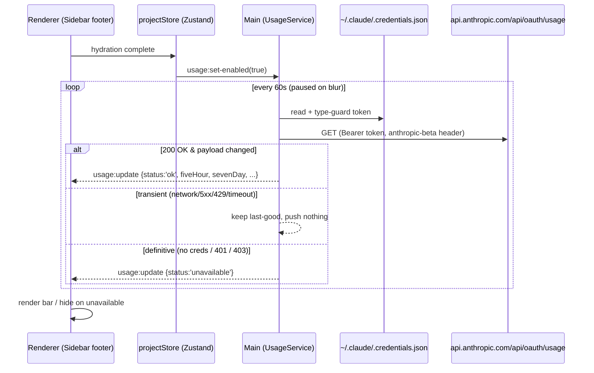

# feat: Claude plan-usage indicator in sidebar footer

## Summary

Add an always-visible usage indicator to the sidebar footer: a thin progress bar showing the Claude plan 5-hour-window utilization with percentage and reset end time (e.g. `45% · tot 19:50`), shifting to warning/danger colors near the limit. A hover popover shows the weekly limit, Sonnet weekly limit, reset times, and extra-usage spend. Data comes from Anthropic's OAuth usage endpoint (the same source as Claude Code's `/usage`), polled every 60s by a new main-process service using the token Claude Code already stores locally.

## Problem Frame

Plan limits (5h window, weekly cap) are only visible by running `/usage` inside a Claude Code chat. When running many parallel sessions from Command, the user has no ambient awareness of how close they are to being rate-limited. The endpoint and token access were verified working during scoping: `GET https://api.anthropic.com/api/oauth/usage` with `Authorization: Bearer <token>` and `anthropic-beta: oauth-2025-04-20` returns `five_hour`, `seven_day`, `seven_day_sonnet` (each `{utilization, resets_at}`) and `extra_usage` (`{used_credits, currency, ...}`).

---

## Requirements

**Indicator**

- R1. The sidebar footer shows a thin progress bar with the 5-hour-window utilization percentage and its reset end time formatted as local `HH:mm` (e.g. `45% · tot 19:50`).
- R2. The bar uses the default accent color below 70%, a warning color at ≥70%, and a danger color at ≥90% utilization.
- R3. Hovering the indicator shows a popover with: weekly limit %, Sonnet weekly limit % (when present in the response), their reset moments, and extra-usage spend with currency.

**Data & resilience**

- R4. A main-process service polls the usage endpoint every 60s, pauses while the window is unfocused, and resumes on focus.
- R5. On transient failures (network error, timeout, 5xx, 429) the renderer keeps showing the last known data; the indicator never flashes empty on a single failed poll.
- R6. On definitive unavailability (credentials file missing/unparseable, 401/403) the indicator hides silently; polling continues and the indicator reappears automatically once data is available again. No re-auth flow.
- R7. The OAuth token never crosses the IPC boundary — only derived usage numbers reach the renderer.
- R8. The service pushes an IPC update only when the payload actually changed.

**Control & conventions**

- R9. A persisted setting (default on) shows/hides the indicator, controllable from Settings and via a hotkey; both paths run through one store action.
- R10. New service logic is unit-tested with Vitest (mocked `fetch` and credentials read); pure decision logic is extracted into exported functions.

---

## Key Technical Decisions

- **New singleton `UsageService` modeled on `GitHubService`, minus the keyed Map.** `GitHubService` is the repo's canonical polling service (interval lifecycle, jittered start, focus-aware `pauseAllPolling`/`resumeAllPolling`, guarded `sendToRenderer`). One global poller needs only `start()`/`stop()`/`pause()`/`resume()`/`destroy()`.
- **Keep-last-good on transient failure, explicit unavailable-state on definitive failure.** Mirrors the `TransientGhError` pattern from `GitHubService` (PR #127): transient errors don't overwrite good data. The payload carries a discriminated status (`ok` / `unavailable`) rather than a separate stale channel — one consumer, simpler contract. Transient failures push nothing.
- **Read `~/.claude/.credentials.json` on every poll, in main only.** Re-reading per poll (cheap, 60s cadence) picks up token rotation by Claude Code without watching the file. Path built with `join(homedir(), '.claude', '.credentials.json')` per existing convention; parsed with a type guard (`unknown`, no `any`), failures logged in dev and mapped to the unavailable state. On 401 the service does not refresh tokens — Claude Code owns the refresh; the next poll re-reads the rotated file.
- **Polling gated by the setting.** The renderer sends `usage:set-enabled` after store hydration (the store already signals hydration) and on every toggle. Main starts/stops the interval accordingly — no polling while the indicator is hidden.
- **One store action owns the toggle side effect.** Settings UI and hotkey both call `toggleUsageIndicator()`, which flips the persisted flag and notifies main — per the documented lesson that click/hotkey paths diverge when logic lives in components (`docs/solutions/logic-errors/hotkey-handler-missing-auto-switch-behavior.md`).
- **Type duplication across the process boundary is deliberate.** `UsageData` is declared canonically in the service, mirrored in `src/types/index.ts` and inline in the preload — same-commit sync, the documented convention from `SessionIndexService`.
- **Hotkey `ui.toggleUsageIndicator` defaults to `Ctrl+Shift+U`.** Verified free in `DEFAULT_HOTKEY_CONFIG` (taken with Ctrl+Shift: O, `\`, E, G, K, A, C, Enter, W, Tab, N, I, T, M). The conflict-detection UI handles user rebinds.

---

## High-Level Technical Design

Directional guidance, not implementation specification.

---

## Implementation Units

### U1. UsageService in the main process

- **Goal:** A singleton service that reads the local OAuth token, polls the usage endpoint every 60s, classifies failures, and pushes normalized data to the renderer.
- **Requirements:** R4, R5, R6, R7, R8
- **Dependencies:** none
- **Files:** `electron/main/services/UsageService.ts` (new), `test/usageService.test.ts` (new)
- **Approach:** Follow `electron/main/services/GitHubService.ts` for lifecycle (`setWindow`, jittered initial timer, `setInterval`, `pause`/`resume`, `destroy`, guarded `sendToRenderer`). Extract pure exported functions so tests need no Electron: parse/type-guard the credentials JSON, map the raw API response to `UsageData`, classify an outcome as `ok` / `transient` / `unavailable`, and decide whether to emit (deep-compare against last pushed payload). Fetch with `AbortController` timeout (~10s). 401/403 and missing/invalid credentials → `unavailable`; network/timeout/5xx/429 → `transient` (keep last-good, emit nothing).
- **Patterns to follow:** `GitHubService.ts` (polling + transient-error handling), `ClaudeHookWatcher.ts` / `SessionIndexService.ts` (defensive `~/.claude` reads with type guards), `claude-state-hook.cjs` (pure exported decision functions).
- **Test scenarios:**
  - Happy path: valid credentials + 200 response → emits `ok` payload with mapped utilization/reset fields.
  - Unchanged consecutive responses → second poll emits nothing (R8).
  - Changed utilization → emits again.
  - Missing credentials file → emits `unavailable` once (not repeatedly while unchanged).
  - Malformed credentials JSON / missing `claudeAiOauth.accessToken` → `unavailable`, no throw.
  - 401 response → `unavailable`; subsequent 200 (token rotated) → `ok` again (R6 recovery).
  - Network error / timeout / 500 / 429 → no emit, last-good retained (R5).
  - Response missing optional fields (`seven_day_sonnet: null`, `extra_usage` absent) → maps without error, optional fields undefined.
  - `pause()` stops the timer; `resume()` restarts it; `destroy()` clears everything (no interval leak).
- **Verification:** Unit tests pass; no token value appears anywhere in emitted payloads.

### U2. IPC wiring: main handlers, preload bridge, renderer types

- **Goal:** Typed end-to-end `usage:*` channel so the renderer can enable/disable polling and receive pushed updates.
- **Requirements:** R4, R7, R9
- **Dependencies:** U1
- **Files:** `electron/main/index.ts`, `electron/preload/index.ts`, `src/types/index.ts`
- **Approach:** Instantiate `UsageService` as a nullable module-level singleton in `createWindow()` like `githubService`; call `destroy()` in the existing cleanup paths; wire `pause()`/`resume()` into the existing window `blur`/`focus` handlers. Register `ipcMain.handle('usage:set-enabled', ...)` validating the boolean arg. Preload: add `usage:update` to `ALLOWED_LISTENER_CHANNELS`, add a `usage` group (`setEnabled` invoke + `onUpdate(cb): Unsubscribe`) mirroring the `github` group, with the `UsageData` type declared inline. Mirror `UsageData` in `src/types/index.ts` and extend `ElectronAPI`.
- **Patterns to follow:** the `github:*` block in `electron/main/index.ts` and the `github` preload group; `SessionIndexService.ts` header comment for the type-sync convention.
- **Test scenarios:** Test expectation: none — pure wiring; behavior covered by U1 unit tests and existing E2E smoke (`test/e2e.spec.ts` app boot).
- **Verification:** `npm run build` type-checks across all three process boundaries; app boots with the service wired.

### U3. Store state: persisted toggle, ephemeral usage data

- **Goal:** `showUsageIndicator` setting (persisted, default on), ephemeral `usageData` state, and a single `toggleUsageIndicator` action that owns the main-process side effect.
- **Requirements:** R9
- **Dependencies:** U2
- **Files:** `src/stores/projectStore.ts`, `test/projectStore.test.ts`
- **Approach:** Add `showUsageIndicator: boolean` (default `true`) to state + `partialize` whitelist (pattern: `terminalPoolSize`). Add non-persisted `usageData: UsageData | null` with a setter the subscription writes into (pattern: `prStatus`, "not persisted" convention). `toggleUsageIndicator()` flips the flag and calls `api.usage.setEnabled(next)`. After store hydration (existing `storeHydrated` signal path), send the current flag to main so polling starts only when enabled.
- **Patterns to follow:** `setTerminalPoolSize` (persisted setting with side effect), `prStatus` (ephemeral data), `docs/solutions/logic-errors/hotkey-handler-missing-auto-switch-behavior.md` (single action for all invocation paths).
- **Test scenarios:**
  - `toggleUsageIndicator` flips the flag and invokes the IPC side effect with the new value (mock `window.electronAPI`).
  - `showUsageIndicator` survives a persist/rehydrate round-trip; `usageData` does not.
  - Default value is `true` on fresh state.
- **Verification:** Store tests pass; toggling in the running app starts/stops main-process polling (observable via dev log).

### U4. UsageIndicator component in the sidebar footer

- **Goal:** The visible bar + percentage + reset time with threshold colors, hover popover with weekly details, hidden when disabled or unavailable.
- **Requirements:** R1, R2, R3, R5, R6
- **Dependencies:** U2, U3
- **Files:** `src/components/Sidebar/UsageIndicator.tsx` (new), `src/components/Sidebar/Sidebar.tsx`
- **Approach:** Subscribe in a `useEffect` via `api.usage.onUpdate` with cleanup (pattern: `WorktreeItem.tsx` PR-status subscription), writing into the store. Render as a slim row inside the footer (`px-3 py-2 border-t border-border` block, `Sidebar.tsx` footer at the bottom of the component). Bar is a rounded track with a width-percentage fill; all colors via Tailwind tokens backed by CSS variables — accent below 70%, warning ≥70%, danger ≥90% (reuse the tokens the orange attention dot and destructive states already use; no hardcoded hex). Reset time: `resets_at` → local `HH:mm` when today, weekday + `HH:mm` otherwise. Popover: copy the `CIStatusIcon` hover pattern (`bg-popover border border-border rounded-md shadow-lg py-1.5 px-2 text-xs`), anchored `bottom-full mb-1` because the footer sits at the window edge. Render nothing when `showUsageIndicator` is false or status is `unavailable`/no data yet. Extract `formatResetTime` and the threshold→color mapping as pure functions for testing.
- **Patterns to follow:** `CIStatusIcon` in `src/components/Worktree/WorktreeItem.tsx` (hover popover), footer styling conventions in `Sidebar.tsx`, `docs/plans/2026-03-19-002-fix-ci-status-tooltip-style-adherence-plan.md` (popover style rules).
- **Test scenarios:**
  - `formatResetTime`: same-day ISO → `HH:mm`; next-day ISO → weekday + time; invalid ISO → fallback (no crash).
  - Threshold mapping: 69 → accent, 70 → warning, 90 → danger, 100 → danger.
  - Component-level (if a React test harness is added, otherwise covered by pure-function tests + manual verification): hidden when status `unavailable`; popover content includes weekly %, Sonnet % only when present, and extra-usage spend.
- **Verification:** Bar renders in the footer with live data; hover shows details; killing network keeps last data; renaming the credentials file hides the bar within one poll and restoring it brings the bar back.

### U5. Settings toggle, hotkey, and docs

- **Goal:** User control surface per project convention: Settings row, `Ctrl+Shift+U` hotkey, CLAUDE.md shortcuts table entry.
- **Requirements:** R9
- **Dependencies:** U3
- **Files:** `src/components/Settings/GeneralSection.tsx`, `src/types/hotkeys.ts`, `src/utils/hotkeys.ts`, `src/App.tsx`, `CLAUDE.md`
- **Approach:** Settings: a toggle row in a card in `GeneralSection.tsx` following the existing `flex items-center justify-between gap-4` layout (pattern: terminal pool size row). Hotkey: add `ui.toggleUsageIndicator` to the `HotkeyAction` union, `DEFAULT_HOTKEY_CONFIG` (UI category, `Ctrl+Shift+U` — confirm no collision in the config before landing), and the `useHotkeys` handler map in `App.tsx` calling `useProjectStore.getState().toggleUsageIndicator()`. Document in the CLAUDE.md "UI & Settings" shortcuts table.
- **Patterns to follow:** `ui.cycleClaudeMode` (most recently added UI hotkey, all four touchpoints).
- **Test scenarios:**
  - Hotkey config: `ui.toggleUsageIndicator` present in `DEFAULT_HOTKEY_CONFIG` with no default-binding conflict (extend the existing hotkey config test if present; otherwise assert uniqueness of default bindings in a small test).
- **Verification:** Toggle works from Settings and via `Ctrl+Shift+U`; both hide the bar and stop polling; `Ctrl+/` overlay lists the new shortcut.

---

## Scope Boundaries

**Not in scope (confirmed during scoping):**

- Per-chat token/cost metrics and per-chat context-window fill — different features.
- Per-profile / multi-account usage: v1 reads only the default `~/.claude` credentials. Profiles pointing at other accounts will see the default account's usage.
- Re-auth or token-refresh flows — Claude Code owns the token lifecycle.

**Deferred to Follow-Up Work:**

- Per-profile usage once profile→config-dir mapping exists.
- macOS support: Claude Code stores credentials in the Keychain on macOS, so `.credentials.json` may be absent there; the indicator will silently hide (acceptable, matches R6). A Keychain reader is follow-up work if macOS becomes a target.

---

## Risks & Dependencies

- **Unofficial endpoint.** `api.anthropic.com/api/oauth/usage` is the endpoint Claude Code's `/usage` uses but is not publicly documented; response shape may change. Mitigation: defensive mapping (optional fields tolerated, type-guarded), `unavailable` fallback hides the indicator instead of breaking the sidebar, and the mapping lives in one pure function.
- **`extra_usage.used_credits` unit is unverified.** Observed value `7784.0` with `currency: "EUR"` likely means cents (€77,84), but this is an assumption — verify against the Claude console value during implementation before fixing the display format.
- **Polling cost.** One GET per minute while focused, none while blurred or disabled — negligible, but keep the jittered start so app launch doesn't race other startup work.

---

## Sources & Research

- Live endpoint verification (this session): `GET https://api.anthropic.com/api/oauth/usage` with `Authorization: Bearer` + `anthropic-beta: oauth-2025-04-20` → 200 with `five_hour`/`seven_day`/`seven_day_sonnet`/`extra_usage`.
- `electron/main/services/GitHubService.ts` — polling lifecycle, transient-error handling, focus pause/resume (wired in `electron/main/index.ts` blur/focus handlers).
- `electron/main/services/SessionIndexService.ts` — cross-boundary type-sync convention; defensive `~/.claude` reads.
- `test/githubService.test.ts`, `test/claudeStateHook.test.ts` — service test templates (mock before import; pure-function extraction).
- `docs/solutions/integration-issues/claude-status-indicator-hook-watcher-session-matching.md`, `docs/solutions/code-review/system-theme-pr89-review-fixes.md`, `docs/solutions/performance-issues/filewatcher-memory-leak-chokidar-startup.md`, `docs/solutions/logic-errors/hotkey-handler-missing-auto-switch-behavior.md` — institutional learnings applied in the KTDs above.
