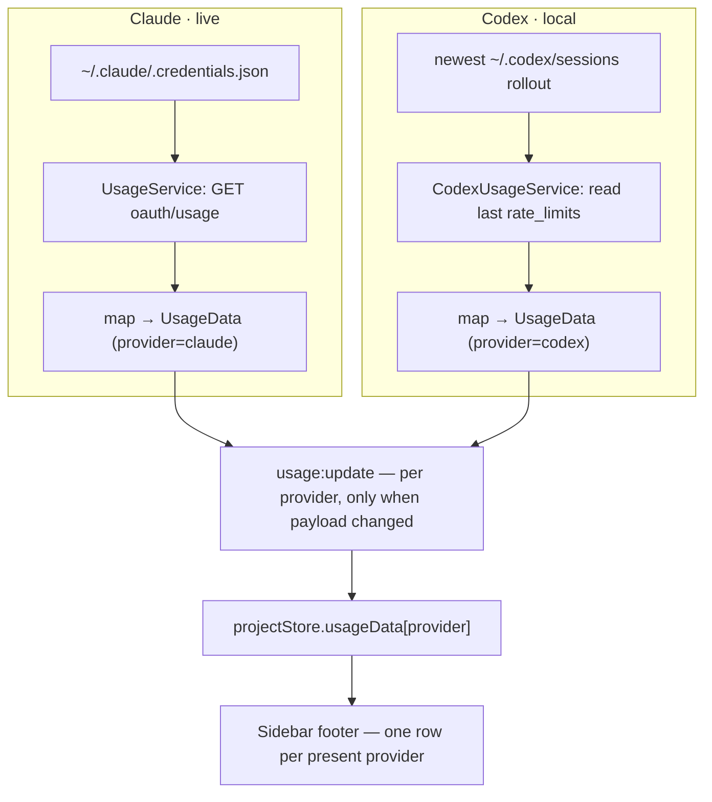

# feat: Codex usage monitoring in sidebar footer

## Goal Capsule

**Objective.** Give Command the same ambient plan-usage awareness for Codex that it already has for Claude — a second labeled bar in the sidebar footer — fed from Codex's locally-persisted rate-limit snapshots instead of a network endpoint.

**Product authority.** Product Contract below, sourced from `docs/plans/2026-07-20-001-feat-codex-usage-monitoring-plan.html`. Product Contract unchanged — this enrichment adds only the HOW (Planning Contract, Implementation Units, Verification, Definition of Done).

**Stop conditions.** Surface a blocker (do not guess) if: the Codex `rate_limits` shape differs materially from what was verified; reusing Claude's `UsageData` shape forces a regression to the shipped Claude path; or a decision would change product scope. Details the plan leaves open (exact helper names, file-scan breadth) are implementer's judgment.

**Open blockers.** None.

---

## Product Contract

### Summary

Add a second usage row to the sidebar footer for **Codex**, mirroring the existing Claude bar (percentage + reset time, threshold colors, hover detail). Its data is read **locally** from the newest Codex session rollout file — `~/.codex/sessions/YYYY/MM/DD/rollout-*.jsonl` — by taking the last `rate_limits` block off its `token_count` events. No network call, no token, only derived numbers crossing IPC. Each provider's row appears only when that provider's credentials exist, so a Claude-only machine looks exactly like today. Codex reuses Claude's two-state model (`ok` / `unavailable`); a window whose `resets_at` is already past is treated as `unavailable`.

### Problem Frame

Command already runs Codex chats as a first-class agent alongside Claude (`codex` binary, hooks in `~/.codex/hooks.json`). Codex's ChatGPT-plan limits bite the same way Claude's do — a 5-hour window and a weekly cap — and you only discover the wall when Codex refuses mid-session. The Claude usage indicator shipped that ambient warning for Claude alone, leaving Codex blind.

OpenAI exposes no clean usage endpoint equivalent to Anthropic's `oauth/usage`. But the Codex CLI persists a rate-limit snapshot into every session rollout after each turn — the same numbers the CLI's own status shows — and that local snapshot is enough to drive the bar.

### Requirements

Preserved verbatim from the Product Contract (R-IDs stable).

**Codex data source**

- R1. A main-process reader locates the most-recently-modified `rollout-*.jsonl` under `~/.codex/sessions/` and extracts the `rate_limits` block from the last `token_count` event in it.
- R2. The Codex bar renders the **rendered window** — the shortest present window (the 5h window when present, otherwise the weekly window; recent Codex rollouts can report weekly-only) — as percentage + reset time, and colors by the highest utilization across all present windows, the same "closest-to-binding wins" rule as the Claude bar.
- R3. Each window's label is derived from its `window_minutes` (e.g. `300`→"5h", `10080`→"wk"); a `null` or absent window (either `primary` or `secondary`) is tolerated without error, and the reader never assumes a 5h window is present.
- R4. Reading is local only: no network request, no credential token, and only derived numbers cross the IPC boundary.

**Freshness & availability (symmetric with Claude)**

- R5. Codex usage has exactly two states, matching Claude: `ok` (render the bar) and `unavailable` (render the existing muted placeholder). No third "stale" state.
- R6. A snapshot whose **rendered window** (the shortest present window) has `resets_at` in the past counts as `unavailable` — the pre-reset percentage no longer reflects the current window. An absent/`undefined` `resets_at` is guarded (never compared as `NaN`).
- R7. A missing `~/.codex/auth.json` — presence checked without reading its contents — or no readable rollout with a `rate_limits` block, → `unavailable`; the row reappears automatically once a fresh snapshot lands. No re-auth flow.
- R8. Transient read errors keep the last-good value (never flash empty on one failed read); an update is pushed only when the payload actually changed.

**Sidebar presentation**

- R9. The footer shows one labeled row per provider (`Claude` / `Codex`). A row appears only when that provider's credentials exist (`~/.claude/.credentials.json` / `~/.codex/auth.json`). With only Claude present, the footer is identical to today.
- R10. Each row keeps the existing bar + percent + reset-time affordance and hover popover. In a two-provider footer, each row (including an `unavailable`/placeholder row) carries its provider label. The Codex popover shows its windows, `plan_type`, and the credits balance when `has_credits` is true, using the same popover label vocabulary as the Claude popover ("5h window" / "Week").

**Control & conventions**

- R11. The existing `showUsageIndicator` setting and `Ctrl+Shift+U` hotkey control both rows together; no separate per-provider toggle in v1.
- R12. New decision logic — rollout selection, `rate_limits` parse, window-label derivation, the `resets_at` staleness check, and level→color mapping — is extracted as pure exported functions and unit-tested with Vitest, matching the Claude service.

### Acceptance Examples

- AE1. *Covers R6.* Newest rollout's rendered (shortest present) window `resets_at` is yesterday → the Codex row shows the muted placeholder, not the stale percentage.
- AE2. *Covers R6, R8.* `resets_at` is in the future and no newer rollout exists → the row keeps showing the last snapshot's percentage unchanged (still correct — usage only rises within a window).
- AE3. *Covers R9.* Only `~/.claude/.credentials.json` exists → the footer shows the Claude row only; no Codex row, no placeholder for it. Matches today's behavior (no provider label either).
- AE4. *Covers R9.* Both credential files exist → two stacked labeled rows.
- AE5. *Covers R2, R3.* Snapshot with `primary.window_minutes=300` (37%) and `secondary.window_minutes=10080` (62%) → the bar shows the 5h window, colored by the 62% weekly, with a "wk 62%" hint. A snapshot with `secondary=null` → single 5h line, no error.
- AE6. *Covers R2, R6.* Weekly-only snapshot (`primary.window_minutes=10080`, `secondary=null`, no 5h window — the observed recent shape) with future `resets_at` → the bar renders the weekly window (its percentage + reset), not `0%`. Same snapshot with past `resets_at` → placeholder (AE1), not a `NaN` comparison.

### Scope Boundaries

**Outside this feature**

- ChatGPT web-chat usage — no local data source. "Codex usage" means the Codex CLI's plan quota (which *is* the ChatGPT-plan quota), not the web chat.
- Per-chat / per-token cost metrics — a different feature.
- Pi usage — the third agent exposes no rate-limit data.
- Live probe calls to read fresh rate-limit headers — rejected (costs tokens, no clean endpoint).

**Deferred to Follow-Up Work**

- A separate per-provider toggle, if hiding one row turns out to be wanted.
- macOS credential/rollout path differences — the row hides silently if the files are absent (matches R7); a platform-specific reader is follow-up.
- Extracting a shared polling base class from `UsageService` + `CodexUsageService` if a third polled provider ever lands (see KTD1 — duplication is deliberate for now).

### Assumptions

**Verified this session (live `~/.codex` inspection)**

- Codex CLI writes `rate_limits` into session rollout `.jsonl` files as `token_count` events.
- `used_percent` is on a 0–100 scale (values up to 62.0 observed) — no fraction conversion needed.
- Two window sizes exist: `window_minutes` `300` (5h) and `10080` (weekly). The pairing is not fixed — older rollouts show `primary`=5h + `secondary`=weekly, but the **newest rollouts on this machine are weekly-only** (`primary.window_minutes=10080`, `secondary=null`). The reader must key off `window_minutes`, never assume a 5h window is present, and render the shortest present window. `resets_at` is a unix epoch in **seconds** (Claude used ISO strings — normalize on read). `credits.balance` is a **string** (observed `"0"`).
- `~/.codex/auth.json` present with `auth_mode: "chatgpt"` and `tokens.access_token`; no API key needed for the file-read path.

**To confirm during implementation**

- The rate-limit snapshot is account-global and identical across concurrent sessions, so the newest rollout file is the freshest source.
- The newest rollout always contains at least one `rate_limits` block; if a just-started session has none, the reader falls back to the next-newest (U1).

---

## Planning Contract

### Key Technical Decisions

- KTD1. **Sibling `CodexUsageService`, not an extension of `UsageService`.** The two share a lifecycle (focus-aware timers, emit-on-change, `destroy`) but have unrelated data sources (authed endpoint vs local file) and failure modes. A sibling keeps each provider's logic isolated and leaves the shipped Claude service almost untouched. Deliberate lifecycle duplication now; extract a base class only if a third polled provider lands (deferred).
- KTD2. **Reuse Claude's `UsageData` shape for Codex; extend it additively.** Codex's windows are the same two horizons Claude has (5h, weekly), so they map onto `fiveHour` / `sevenDay` by `window_minutes` — but the mapping must not assume the 5h window is present (recent rollouts are weekly-only). Add a required `provider: 'claude' | 'codex'` discriminator, an optional `label?` on `UsageWindow` (Codex sets it from `window_minutes`; Claude leaves it undefined and the component falls back to its fixed labels), an optional `planType?` on `UsageData`, and an optional `credits?: { hasCredits: boolean; balance: string }` on `UsageData` for the Codex popover (`balance` is a string; do **not** overload Claude's `extraUsage`, which is spend-in-cents with different semantics). Additive only — no change to Claude's mapping semantics. Normalize Codex `resets_at` (epoch seconds) to an ISO string on read so `formatResetTime` works unchanged.
- KTD3. **Store holds a per-provider map; the component renders one row per present provider.** Change `usageData: UsageData | null` → `usageData: Partial<Record<UsageProvider, UsageData>>`, keyed by `data.provider`. `usageData` stays non-persisted, so no migration. Extract a `UsageBar` sub-component from the current markup; `UsageIndicator` maps over present providers and shows the provider label only when 2+ providers are present (so a Claude-only footer is byte-for-byte today).
- KTD4. **Reader picks the newest rollout, reads the last `rate_limits`, checks staleness structurally.** Staleness and the displayed bar both key off the **rendered window** — the shortest present window (`fiveHour` when present, else `sevenDay`). `renderedWindow.resets_at < now` (both in seconds) → `unavailable`, Codex's equivalent of Claude's failed-poll. Guard an `undefined` `resets_at` before the epoch comparison so a weekly-only snapshot never evaluates `NaN <= now` (which would silently never mark stale). The Codex row is only ever populated (ok *or* unavailable) when `~/.codex/auth.json` exists — checked by existence only (`fs.access`/`existsSync`), never `readFile`/parse, so the OAuth token is never loaded into memory. When the file is absent the service pushes nothing, so no Codex key lands in the store and no row/placeholder shows (AE3).
- KTD5. **Reuse the existing enable + cadence; no new setting or hotkey.** The one `usage:set-enabled` handler starts/stops *both* services; the focus `blur`/`focus` handlers pause/resume both; `showUsageIndicator` and `Ctrl+Shift+U` already gate the whole indicator. Codex reuses the 60s focused / 300s blurred cadence, re-reading the newest rollout each tick.

### High-Level Technical Design

Both providers share one `usage:update` spine; only the source and the fetch/read step differ.

---

## Implementation Units

### U1. CodexUsageService: reader + pure functions

- **Goal.** A main-process singleton that reads the newest Codex rollout, extracts the last `rate_limits` block, maps it to a `UsageData` (provider `codex`), applies the staleness rule, and pushes to the renderer — with the same lifecycle as `UsageService`.
- **Requirements.** R1, R2, R3, R4, R5, R6, R7, R8, R12.
- **Dependencies.** U2 (needs the extended `UsageData` type + `UsageProvider`).
- **Files.** `electron/main/services/CodexUsageService.ts` (new), `test/codexUsageService.test.ts` (new).
- **Approach.** Mirror `electron/main/services/UsageService.ts` lifecycle (`setWindow`, jittered initial timer, `setInterval`, `pause`/`resume`, `setEnabled`, `emitIfChanged`, guarded `sendToRenderer`, `destroy`). Extract pure exported functions so tests need no Electron:
  - locate the newest `rollout-*.jsonl` under `~/.codex/sessions/` (recursive `YYYY/MM/DD/`), tolerating a missing dir;
  - parse the last `token_count` event's `rate_limits` from a file's lines (scan from the end; fall back to the next-newest file when the newest has no `rate_limits` block);
  - map `rate_limits` → `UsageData` by `window_minutes`, never by position: a `10080`-minute window → `sevenDay`, a `~300`-minute window → `fiveHour`. Do **not** assume a 5h window exists — a weekly-only snapshot maps `sevenDay` and leaves `fiveHour` undefined. Each window carries `label` from `window_minutes`, `utilization` = `used_percent` (0–100, no division), `resetsAt` = ISO from epoch seconds. Set `provider: 'codex'`, `planType` from `plan_type`, `credits` from the `credits` block; tolerate `secondary: null` / an absent window;
  - rendered window = the shortest present window (`fiveHour ?? sevenDay`); staleness → `unavailable` when `renderedWindow?.resetsAt` is present AND its epoch `<= Date.now()`; an undefined `resetsAt` is guarded, never compared as `NaN`;
  - gate: no `~/.codex/auth.json` → push nothing. Existence check only (`fs.access`/`existsSync`) — never `readFile`/parse it, so the token is never loaded;
  - **logging discipline (mirror `UsageService`): log fixed-string messages only.** Never log `auth.json` contents, a rollout line, or a parse-error object that embeds file data — rollout lines contain the user's own prompts (PII).
  Emit `{ status: 'unavailable', provider: 'codex' }` for definitive unavailability; keep last-good and emit nothing on transient read errors.
- **Patterns to follow.** `electron/main/services/UsageService.ts` (lifecycle, transient vs definitive, emit-on-change), `electron/main/services/SessionIndexService.ts` (defensive `~/.codex`/`~/.claude` reads, JSONL parsing), `claude-state-hook.cjs` (pure exported decision functions).
- **Test scenarios.**
  - Happy path: rollout with `primary`(300,37%) + `secondary`(10080,62%), future resets → `ok` with `fiveHour`/`sevenDay` mapped, labels "5h"/"wk", `provider: 'codex'`, `planType`. *Covers AE5.*
  - `secondary: null` → maps `fiveHour` only, no throw. *Covers AE5.*
  - Weekly-only snapshot (`primary.window_minutes=10080`, `secondary=null`), future resets → `ok` with `sevenDay` set and `fiveHour` undefined; rendered window = `sevenDay`. *Covers AE6.*
  - Rendered (shortest present) window `resets_at` in the past → `unavailable`; test both the 5h-present and weekly-only shapes. *Covers AE1, AE6.*
  - Weekly-only snapshot with `fiveHour` undefined does NOT throw or wrongly report `ok` (guards the `NaN <= now` trap). *Covers AE6.*
  - Future `resets_at`, unchanged snapshot on second read → emits once, second read emits nothing (R8).
  - No `~/.codex/auth.json` → pushes nothing (no codex entry); the gate uses existence only, never reads the file. *Covers AE3.*
  - Newest rollout has no `rate_limits` event → falls back to next-newest; none anywhere → `unavailable`.
  - Missing/empty `~/.codex/sessions` dir → `unavailable`, no throw.
  - Malformed JSONL line → skipped, no throw; a real snapshot later in the file still parses.
  - `used_percent` values 0, 62, 100 map straight through (0–100 scale, no division).
  - Logging: a parse failure / skipped malformed line logs a fixed string only — assert no rollout content and no `access_token` value appears in any log call.
  - `pause()`/`resume()`/`destroy()` manage the timer with no leak.
- **Verification.** `test/codexUsageService.test.ts` passes; no token value and no rollout content ever appears in emitted payloads or logs.

### U2. Extend the usage payload type (additive)

- **Goal.** A provider-tagged, Codex-compatible `UsageData` shared across the process boundary.
- **Requirements.** R2, R3, R4, R10.
- **Dependencies.** None.
- **Files.** `shared/ipc-types.ts`, `src/types/index.ts`, `electron/main/services/UsageService.ts`, `test/usageService.test.ts`.
- **Approach.** Add `export type UsageProvider = 'claude' | 'codex'`. Add required `provider: UsageProvider` to `UsageData`; add optional `label?: string` to `UsageWindow`; add optional `planType?: string` and optional `credits?: { hasCredits: boolean; balance: string }` to `UsageData` (the Codex credits block — `balance` is a string; kept separate from Claude's `extraUsage`). Mirror the same edits in `src/types/index.ts` (same-commit type sync per the `SessionIndexService` convention). In `UsageService.ts`, set `provider: 'claude'` on the mapped `ok` payload and on the `UNAVAILABLE` constant — the only Claude-path change.
- **Patterns to follow.** Existing `UsageData`/`UsageWindow` in `shared/ipc-types.ts`; `SessionIndexService.ts` header comment (cross-boundary type sync).
- **Test scenarios.** `Test expectation: none` — pure type + additive field wiring; behavior is covered by U1 (codex) and the existing `test/usageService.test.ts` (update its expectations to include `provider: 'claude'`).
- **Verification.** `npm run build` type-checks across main/preload/renderer; existing `usageService.test.ts` updated and green.

### U3. Wire CodexUsageService into the main process

- **Goal.** Instantiate, focus-gate, enable, and tear down the Codex service alongside the Claude one, reusing the existing IPC channels.
- **Requirements.** R4, R11.
- **Dependencies.** U1.
- **Files.** `electron/main/index.ts`.
- **Approach.** Add a `codexUsageService` module-level nullable singleton created in `createWindow()` next to `usageService`; `setWindow(win)`. Fan the existing `usage:set-enabled` handler out to both services. Add `codexUsageService?.pause()` / `.resume()` to the existing `blur` / `focus` handlers. Call `codexUsageService?.destroy()` in the same cleanup paths as `usageService`. No new IPC channel — the Codex service emits on `usage:update` (payload carries `provider`).
- **Patterns to follow.** The `usageService` lifecycle in `electron/main/index.ts` (creation, blur/focus, `usage:set-enabled`, destroy).
- **Test scenarios.** `Test expectation: none` — pure wiring; covered by U1 unit tests and the existing E2E boot smoke (`test/e2e.spec.ts`).
- **Verification.** `npm run build` passes; app boots with both services wired (dev-log observable).

### U4. Store: per-provider usage map

- **Goal.** Hold usage data keyed by provider so the footer can render both rows.
- **Requirements.** R9, R11.
- **Dependencies.** U2.
- **Files.** `src/stores/projectStore.ts`, `test/projectStore.test.ts`.
- **Approach.** Change `usageData: UsageData | null` → `usageData: Partial<Record<UsageProvider, UsageData>>` (default `{}`). `setUsageData(data)` writes `data` under `data.provider` (merge, don't replace the whole map). The `usage:update` subscription in `onRehydrateStorage` calls `setUsageData` unchanged. `toggleUsageIndicator` unchanged (one `setEnabled` fans out in main). `usageData` remains non-persisted (not in `partialize`), so no migration.
- **Patterns to follow.** `prStatus` (ephemeral, keyed data); existing `setUsageData` and the `onRehydrateStorage` `usage:update` subscription.
- **Test scenarios.**
  - `setUsageData({provider:'claude',...})` then `setUsageData({provider:'codex',...})` → map holds both keys.
  - Re-setting one provider replaces only that key, leaves the other intact.
  - `usageData` starts `{}` and does not survive a persist/rehydrate round-trip (still ephemeral).
- **Verification.** `test/projectStore.test.ts` passes.

### U5. UsageIndicator renders one row per provider

- **Goal.** The footer shows a labeled bar per present provider, reusing the existing bar/popover, with staleness and single-provider parity handled.
- **Requirements.** R2, R3, R5, R6, R9, R10.
- **Dependencies.** U2, U4.
- **Files.** `src/components/Sidebar/UsageIndicator.tsx`, `src/utils/usageFormat.ts`, `test/usageFormat.test.ts`.
- **Approach.** Extract a `UsageBar` sub-component from the current markup (bar + percent + reset time + hover popover + `weekDrives` hint), parameterized by an optional provider label and a `UsageData`. The bar's displayed window is the **rendered window** = the shortest present window (`fiveHour ?? sevenDay`) — never hardcode `fiveHour`, or a weekly-only Codex snapshot renders `0%`; color by the max utilization across present windows. `UsageIndicator` reads the provider map, iterates present providers in fixed order (`claude`, `codex`), and renders a `UsageBar` per entry.
  - **Label:** a fixed-width leading segment on the row (e.g. `text-[10px] text-muted-foreground w-10 shrink-0` reading `Claude`/`Codex`) before the `flex-1` bar, shown only when 2+ provider rows are present. The label threads through the placeholder branch too, so an `unavailable` row in a two-provider footer is still labeled (which provider is down must be legible).
  - **States per provider:** `ok` → bar; `unavailable` (or creds-present-but-no-data-yet) → the existing muted placeholder (labeled when 2+ rows); provider key absent → render nothing for it (AE3).
  - **Empty map at startup:** when the map is `{}` but `showUsageIndicator` is on, render the existing single muted placeholder (preserve today's "enabled but no data yet" behavior) — do not render an empty footer.
  - In `usageFormat.ts`, add `windowLabel(window, fallback)` (prefer `window.label`, else the field default "5h"/"wk"); `formatResetTime` already handles ISO.
  - **Popover:** reuse the Claude popover's `DetailRow` label vocabulary ("5h window" / "Week") for both providers so adjacent popovers read consistently; add `planType`, and a credits line only when `credits.hasCredits` (render `credits.balance`) — otherwise omit.
- **Patterns to follow.** The current `UsageIndicator.tsx` bar + placeholder + `DetailRow` popover; `formatResetTime`/`usageLevel` in `usageFormat.ts`.
- **Test scenarios.**
  - `windowLabel`: window with `label:"5h"` → "5h"; no label + fiveHour slot → "5h"; no label + sevenDay slot → "wk".
  - `usageLevel` unchanged (69→normal, 70→warning, 90→danger).
  - Component-level (pure-function coverage + manual): single provider → no label, identical to today (AE3); two providers → two labeled rows (AE4); Codex `ok` primary 37% / secondary 62% → 5h bar colored by 62%, "wk 62%" hint (AE5); weekly-only Codex `ok` → weekly bar with real % (not 0%), label "wk" (AE6); Codex `unavailable` with a Claude row present → labeled placeholder row; Codex key absent → no Codex element (AE3); empty map + enabled → single muted placeholder (no empty footer, no regression).
- **Verification.** `test/usageFormat.test.ts` passes; footer renders both rows with live data; removing `~/.codex/auth.json` drops the Codex row within one poll; a stale rollout shows the placeholder; a weekly-only rollout shows a non-zero weekly bar.

### U6. Docs

- **Goal.** Keep `CLAUDE.md` accurate about the usage services.
- **Requirements.** —
- **Dependencies.** U1, U3.
- **Files.** `CLAUDE.md`.
- **Approach.** Add a `CodexUsageService` row to the Main Process Services table (reads newest `~/.codex` rollout, pushes `usage:update` with `provider: 'codex'`); note the usage indicator now covers Claude and Codex. No shortcut-table change — the existing `Ctrl+Shift+U` toggle covers both.
- **Test scenarios.** `Test expectation: none` — docs only.
- **Verification.** Table entry present and accurate.

---

## Verification Contract

- **Type-check across boundaries.** `npm run build` (TypeScript + Vite + electron-builder) passes — proves the additive `UsageData`/`UsageProvider` changes hold in main, preload, and renderer.
- **Unit tests.** `npm run test` (runs `npm run pretest` automatically). New/updated: `test/codexUsageService.test.ts`, `test/usageService.test.ts` (add `provider: 'claude'`), `test/projectStore.test.ts`, `test/usageFormat.test.ts`. Every feature-bearing unit's scenarios above are green.
- **No token/PII in payloads or logs.** Assert no `access_token` value and no rollout line content appears in any emitted `usage:update` payload **or in any log call** from the Codex reader (U1). `auth.json` is never read (existence check only).
- **Manual smoke (dev run).** With both `~/.claude/.credentials.json` and `~/.codex/auth.json` present: two labeled rows render. Rename `~/.codex/auth.json` → Codex row disappears within one poll; restore → it returns. A rollout whose `resets_at` is in the past → Codex placeholder, not a stale percentage. Only-Claude machine → footer identical to today (no label).

---

## Definition of Done

- All requirements R1–R12 are satisfied or explicitly traced to a unit above.
- Acceptance Examples AE1–AE6 hold (covered by the cited test scenarios), including the weekly-only Codex shape (AE6).
- `npm run build` and `npm run test` pass; no new `any` types; ESLint clean.
- The Claude usage path is unchanged in behavior (only the additive `provider` tag and updated test expectations).
- The Codex reader never reads `auth.json` contents and never logs rollout content or a token; no token/PII appears in any payload or log (asserted by test).
- Per-unit verification (U1–U6) met; pure decision logic is exported and unit-tested (R12).
- `CLAUDE.md` reflects the new service.
- No dead-end or experimental code left in the diff; no leftover debug logging.
