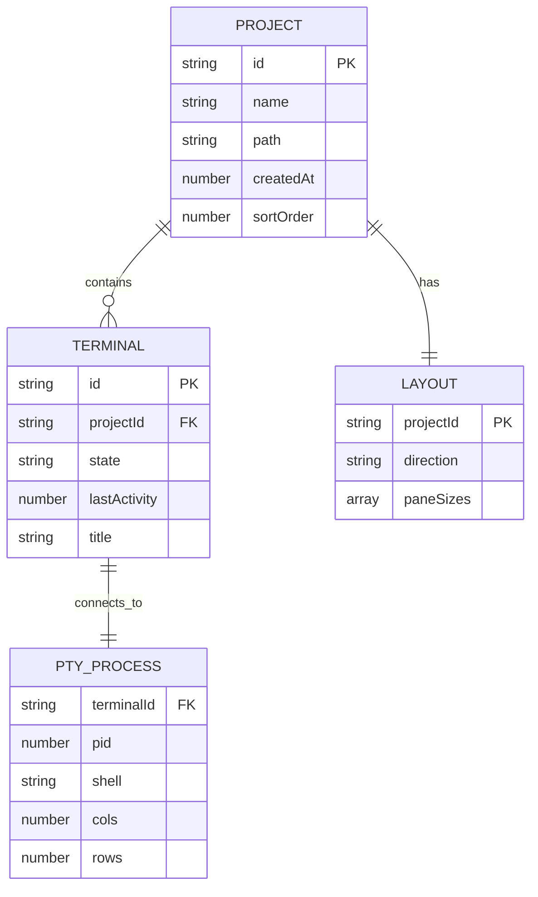

# feat: Claude Code Command Center

> A desktop application for managing multiple Claude Code terminal instances across projects

## Overview

Build an Electron + React desktop application that serves as a command center for Claude Code CLI. The app provides a unified interface to manage multiple projects, each with up to 3 Claude Code terminal instances, featuring visual notifications when any terminal needs user input.

### Key Value Proposition

- **Multi-tasking**: Work on multiple projects simultaneously without losing context
- **Awareness**: Visual notifications (green blinking) when Claude Code finishes and needs input
- **Organization**: All Claude Code sessions organized by project in one place
- **Efficiency**: Split-view for 2-3 terminals side-by-side within a project

## Problem Statement / Motivation

When working with multiple Claude Code instances across different projects:

1. **Context switching pain**: Each Claude Code instance runs in a separate terminal, making it hard to track multiple conversations
2. **Missed completions**: No way to know when Claude Code finishes a task in a background terminal
3. **No unified view**: Projects scattered across terminal tabs/windows
4. **Manual management**: Must manually navigate to each terminal to check status

This command center solves these problems by centralizing all Claude Code sessions with intelligent notifications.

## Technical Approach

### Architecture Overview

```
┌─────────────────────────────────────────────────────────────────────────┐
│                        ELECTRON MAIN PROCESS                             │
├─────────────────────────────────────────────────────────────────────────┤
│  ┌─────────────────┐  ┌──────────────────┐  ┌────────────────────┐     │
│  │  TerminalManager │  │  ProjectManager  │  │  NotificationSvc   │     │
│  │  (node-pty)      │  │  (persistence)   │  │  (Electron API)    │     │
│  └────────┬─────────┘  └────────┬─────────┘  └─────────┬──────────┘     │
│           │                     │                      │                 │
│           └─────────────────────┼──────────────────────┘                 │
│                                 │                                        │
│                          IPC BRIDGE                                      │
│                       (contextBridge)                                    │
├─────────────────────────────────────────────────────────────────────────┤
│                        ELECTRON RENDERER PROCESS                         │
├─────────────────────────────────────────────────────────────────────────┤
│  ┌──────────────────────────────────────────────────────────────────┐   │
│  │                         REACT APP                                 │   │
│  │  ┌────────────┐  ┌────────────────────────────────────────────┐  │   │
│  │  │  Sidebar   │  │              Terminal Area                  │  │   │
│  │  │            │  │  ┌──────────────────────────────────────┐  │  │   │
│  │  │  Project A │  │  │  react-resizable-panels              │  │   │
│  │  │   ├─ T1 🟢│  │  │  ┌─────────────┬─────────────────┐   │  │   │
│  │  │   └─ T2   │  │  │  │  Terminal 1 │   Terminal 2    │   │  │   │
│  │  │            │  │  │  │  (xterm.js) │   (xterm.js)    │   │  │   │
│  │  │  Project B │  │  │  │             │                 │   │  │   │
│  │  │   └─ T1   │  │  │  └─────────────┴─────────────────┘   │  │   │
│  │  │            │  │  └──────────────────────────────────────┘  │  │   │
│  │  └────────────┘  └────────────────────────────────────────────┘  │   │
│  │                                                                   │   │
│  │  State: Zustand (projects, terminals, layouts)                   │   │
│  └──────────────────────────────────────────────────────────────────┘   │
└─────────────────────────────────────────────────────────────────────────┘
```

### Technology Stack

| Layer | Technology | Purpose |
|-------|------------|---------|
| Desktop Framework | Electron 34+ | Cross-platform desktop app |
| Build Tool | electron-vite | Fast HMR, modern bundling |
| Frontend | React 18 + TypeScript | UI components |
| Terminal Emulation | xterm.js + addons | Render terminal output |
| PTY Backend | node-pty | Spawn shell processes |
| Split Views | react-resizable-panels | Resizable terminal panes |
| State Management | Zustand + persist | Project/terminal state |
| Styling | Tailwind CSS | Utility-first CSS |
| UI Components | shadcn/ui | Accessible, customizable |

### Project Structure

```
claude-code-command-center/
├── src/
│   ├── main/                           # Electron main process
│   │   ├── index.ts                    # App entry, window management
│   │   ├── ipc/
│   │   │   ├── terminal-handlers.ts    # PTY IPC handlers
│   │   │   ├── project-handlers.ts     # Project management IPC
│   │   │   └── notification-handlers.ts
│   │   ├── services/
│   │   │   ├── TerminalManager.ts      # node-pty lifecycle
│   │   │   ├── InputDetector.ts        # Detect "needs input" state
│   │   │   └── ProjectPersistence.ts   # Save/load projects
│   │   └── utils/
│   │       └── shell.ts                # Shell detection (Windows)
│   │
│   ├── preload/
│   │   └── index.ts                    # Secure context bridge
│   │
│   └── renderer/                       # React application
│       ├── src/
│       │   ├── App.tsx
│       │   ├── main.tsx
│       │   ├── components/
│       │   │   ├── Layout/
│       │   │   │   └── MainLayout.tsx  # PanelGroup wrapper
│       │   │   ├── Sidebar/
│       │   │   │   ├── Sidebar.tsx
│       │   │   │   ├── ProjectList.tsx
│       │   │   │   ├── ProjectItem.tsx
│       │   │   │   └── TerminalListItem.tsx
│       │   │   ├── Terminal/
│       │   │   │   ├── Terminal.tsx     # xterm.js component
│       │   │   │   ├── TerminalPane.tsx
│       │   │   │   └── TerminalHeader.tsx
│       │   │   └── ui/                  # shadcn/ui components
│       │   ├── hooks/
│       │   │   ├── useTerminal.ts
│       │   │   ├── useProjects.ts
│       │   │   └── useNotifications.ts
│       │   ├── stores/
│       │   │   ├── projectStore.ts
│       │   │   └── terminalStore.ts
│       │   ├── lib/
│       │   │   └── ipc.ts               # Type-safe IPC wrapper
│       │   └── types/
│       │       └── index.ts
│       └── index.html
│
├── electron.vite.config.ts
├── package.json
├── tsconfig.json
├── tsconfig.node.json
├── tsconfig.web.json
├── tailwind.config.js
└── CLAUDE.md
```

### Data Models

```typescript
// types/index.ts

interface Project {
  id: string;
  name: string;
  path: string;
  createdAt: number;
  sortOrder: number;
}

interface TerminalSession {
  id: string;
  projectId: string;
  state: 'starting' | 'running' | 'needs_input' | 'stopped' | 'error';
  lastActivity: number;
  title: string;  // Auto-detected from PTY
}

interface TerminalLayout {
  projectId: string;
  direction: 'horizontal' | 'vertical';
  paneSizes: number[];  // Percentages
}

interface AppState {
  projects: Project[];
  terminals: Map<string, TerminalSession>;
  layouts: Map<string, TerminalLayout>;
  activeProjectId: string | null;
  activeTerminalId: string | null;
}
```

### Input Detection Strategy

Multiple layers for detecting when Claude Code needs input:

```typescript
// services/InputDetector.ts

class InputDetector {
  private idleTimeMs = 3000;
  private lastOutputTime: Map<string, number> = new Map();

  // Patterns that indicate Claude Code is waiting
  private promptPatterns = [
    /\? .*:$/,                     // Generic prompt
    /\[y\/N\]/i,                   // Yes/No choice
    /\(y\/n\)/i,                   // Approval prompt
    /Press Enter/i,               // Continue prompt
    /Select an option/i,          // Menu selection
    /> $/,                         // Command prompt
    /^> /m,                        // Claude Code input prompt
  ];

  onTerminalOutput(terminalId: string, data: string) {
    this.lastOutputTime.set(terminalId, Date.now());

    // Check for prompt patterns
    const lastLines = data.split('\n').slice(-5).join('\n');
    for (const pattern of this.promptPatterns) {
      if (pattern.test(lastLines)) {
        return { needsInput: true, reason: 'prompt_detected' };
      }
    }

    return { needsInput: false };
  }

  // Called periodically to check idle state
  checkIdleState(terminalId: string): boolean {
    const lastOutput = this.lastOutputTime.get(terminalId) ?? 0;
    return Date.now() - lastOutput > this.idleTimeMs;
  }
}
```

### IPC Communication

```typescript
// preload/index.ts

import { contextBridge, ipcRenderer } from 'electron';

contextBridge.exposeInMainWorld('electronAPI', {
  // Terminal operations
  terminal: {
    create: (projectId: string) =>
      ipcRenderer.invoke('terminal:create', projectId),
    write: (terminalId: string, data: string) =>
      ipcRenderer.send('terminal:write', terminalId, data),
    resize: (terminalId: string, cols: number, rows: number) =>
      ipcRenderer.send('terminal:resize', terminalId, cols, rows),
    close: (terminalId: string) =>
      ipcRenderer.send('terminal:close', terminalId),

    // Events from main
    onData: (callback: (id: string, data: string) => void) =>
      ipcRenderer.on('terminal:data', (_, id, data) => callback(id, data)),
    onStateChange: (callback: (id: string, state: string) => void) =>
      ipcRenderer.on('terminal:state', (_, id, state) => callback(id, state)),
    onExit: (callback: (id: string, code: number) => void) =>
      ipcRenderer.on('terminal:exit', (_, id, code) => callback(id, code)),
  },

  // Project operations
  project: {
    list: () => ipcRenderer.invoke('project:list'),
    add: (path: string, name?: string) =>
      ipcRenderer.invoke('project:add', path, name),
    remove: (id: string) => ipcRenderer.invoke('project:remove', id),
    selectFolder: () => ipcRenderer.invoke('project:select-folder'),
  },

  // Notifications
  notification: {
    show: (title: string, body: string) =>
      ipcRenderer.send('notification:show', title, body),
  },

  // Cleanup
  removeAllListeners: (channel: string) =>
    ipcRenderer.removeAllListeners(channel),
});
```

## Implementation Phases

### Phase 1: Foundation

**Goal**: Basic Electron + React app with single terminal

**Tasks**:
- [ ] Initialize electron-vite project
- [ ] Configure TypeScript, Tailwind, shadcn/ui
- [ ] Create main process with basic window
- [ ] Set up preload script with context bridge
- [ ] Implement TerminalManager with node-pty
- [ ] Create Terminal component with xterm.js
- [ ] Wire up IPC for terminal data flow
- [ ] Verify Claude Code CLI starts automatically

**Files to create**:
- `src/main/index.ts`
- `src/main/services/TerminalManager.ts`
- `src/preload/index.ts`
- `src/renderer/src/components/Terminal/Terminal.tsx`

**Validation**:
- [ ] App launches without errors
- [ ] Terminal renders and accepts input
- [ ] `claude` command runs when terminal opens
- [ ] Terminal output displays correctly

### Phase 2: Project Management

**Goal**: Sidebar with project list, add/remove projects

**Tasks**:
- [ ] Create Zustand store for projects
- [ ] Implement project persistence (electron-store or JSON file)
- [ ] Create Sidebar component
- [ ] Create ProjectList and ProjectItem components
- [ ] Add folder picker dialog
- [ ] Associate terminals with projects
- [ ] Handle project switching

**Files to create**:
- `src/renderer/src/stores/projectStore.ts`
- `src/main/services/ProjectPersistence.ts`
- `src/renderer/src/components/Sidebar/Sidebar.tsx`
- `src/renderer/src/components/Sidebar/ProjectList.tsx`
- `src/renderer/src/components/Sidebar/ProjectItem.tsx`

**Validation**:
- [ ] Can add project via folder picker
- [ ] Projects persist across app restarts
- [ ] Can remove projects
- [ ] Active project highlighted in sidebar

### Phase 3: Multi-Terminal & Split Views

**Goal**: Support 2-3 terminals per project with split layout

**Tasks**:
- [ ] Integrate react-resizable-panels
- [ ] Create MainLayout component with PanelGroup
- [ ] Update TerminalManager to handle multiple PTYs
- [ ] Create TerminalPane wrapper component
- [ ] Add "New Terminal" button (with direction choice)
- [ ] Implement terminal close functionality
- [ ] Store layout per project
- [ ] Enforce 3 terminal limit

**Files to create**:
- `src/renderer/src/components/Layout/MainLayout.tsx`
- `src/renderer/src/components/Terminal/TerminalPane.tsx`
- `src/renderer/src/components/Terminal/TerminalHeader.tsx`

**Validation**:
- [ ] Can create second terminal (split view)
- [ ] Can create third terminal
- [ ] Cannot create fourth terminal (graceful message)
- [ ] Resize handles work
- [ ] Layout persists per project

### Phase 4: Notifications & Input Detection

**Goal**: Visual and system notifications when Claude needs input

**Tasks**:
- [ ] Implement InputDetector service
- [ ] Add terminal state tracking (needs_input state)
- [ ] Create blinking indicator CSS animation
- [ ] Show indicator on TerminalListItem in sidebar
- [ ] Implement native Electron notifications
- [ ] Detect input to dismiss notification state
- [ ] Handle multiple terminals needing input

**Files to create**:
- `src/main/services/InputDetector.ts`
- `src/renderer/src/hooks/useNotifications.ts`

**Validation**:
- [ ] Green blink when Claude finishes task
- [ ] Blink visible in sidebar for background projects
- [ ] Native OS notification when app minimized
- [ ] Indicator dismisses when user types

### Phase 5: Polish & Windows Optimization

**Goal**: Production-ready, optimized for Windows

**Tasks**:
- [ ] Windows shell detection (PowerShell default)
- [ ] Test ConPTY integration
- [ ] Add keyboard shortcuts (Ctrl+T, Ctrl+W, etc.)
- [ ] Implement copy/paste in terminal
- [ ] Add app menu
- [ ] Handle app close gracefully (confirm if terminals running)
- [ ] Add error states and recovery options
- [ ] Performance optimization (scrollback limits)
- [ ] Package for Windows installer

**Validation**:
- [ ] App works on Windows 10 and 11
- [ ] PowerShell and Git Bash work
- [ ] Keyboard shortcuts functional
- [ ] Clean shutdown with running terminals
- [ ] Installer creates Start Menu entry

## ERD: State Relationships



## Acceptance Criteria

### Functional Requirements

- [ ] User can add projects via folder picker
- [ ] User can see all projects in sidebar
- [ ] User can create up to 3 Claude Code terminals per project
- [ ] User can split terminals horizontally or vertically
- [ ] User can resize terminal panes
- [ ] User can switch between projects (terminals run in background)
- [ ] User receives visual notification (green blink) when Claude needs input
- [ ] User receives native OS notification when app is minimized
- [ ] User can close individual terminals
- [ ] User can remove projects (with confirmation if terminals active)
- [ ] State persists across app restarts (projects, layouts)
- [ ] Claude Code CLI starts automatically when creating terminal

### Non-Functional Requirements

- [ ] App starts in < 3 seconds
- [ ] Terminal renders smoothly at 60fps
- [ ] Memory usage < 500MB with 3 projects, 9 terminals
- [ ] App works on Windows 10 (build 18309+) and Windows 11
- [ ] Accessible keyboard navigation

### Quality Gates

- [ ] TypeScript strict mode passes
- [ ] ESLint passes with no warnings
- [ ] Manual testing on Windows 10 and 11
- [ ] App packages successfully for Windows

## Open Questions / Decisions Needed

### Critical (Before Implementation)

| # | Question | Options | Impact |
|---|----------|---------|--------|
| 1 | Exact Claude Code CLI command? | `claude`, `npx @anthropic/claude-code`, other | Core functionality |
| 2 | Auto-restart terminals on app launch? | Yes (resume), No (manual start) | UX, performance |
| 3 | What happens on app close with running terminals? | Kill, Warn+Kill, Keep running | Data loss risk |
| 4 | Default Windows shell? | PowerShell, CMD, Git Bash, User choice | Compatibility |
| 5 | Terminal scrollback buffer size? | 1000, 5000, 10000, configurable | Memory usage |

### Important (Affects UX)

| # | Question | Default Assumption |
|---|----------|-------------------|
| 6 | Can user rename projects? | Yes, via right-click context menu |
| 7 | Project ordering in sidebar? | Manual (drag-and-drop) |
| 8 | Sound with notifications? | No sound by default, configurable |
| 9 | Search within terminal output? | Yes, via Ctrl+F |
| 10 | Export/import projects config? | Out of scope for v1 |

## Dependencies

### NPM Packages

```json
{
  "dependencies": {
    "react": "^18.2.0",
    "react-dom": "^18.2.0",
    "@xterm/xterm": "^5.5.0",
    "@xterm/addon-fit": "^0.10.0",
    "@xterm/addon-web-links": "^0.11.0",
    "@xterm/addon-search": "^0.15.0",
    "node-pty": "^1.0.0",
    "react-resizable-panels": "^2.0.0",
    "zustand": "^4.5.0",
    "electron-store": "^8.2.0",
    "lucide-react": "^0.400.0",
    "clsx": "^2.1.0",
    "tailwind-merge": "^2.3.0"
  },
  "devDependencies": {
    "electron": "^34.0.0",
    "electron-vite": "^2.3.0",
    "@electron/rebuild": "^3.6.0",
    "@vitejs/plugin-react": "^4.3.0",
    "typescript": "~5.6.0",
    "tailwindcss": "^3.4.0",
    "@types/react": "^18.3.0",
    "@types/react-dom": "^18.3.0"
  }
}
```

### System Requirements

- Node.js 20+
- Windows 10 (build 18309+) or Windows 11
- Claude Code CLI installed and in PATH

## References

### Internal Documentation
- Research: xterm.js + node-pty integration patterns
- Research: Electron IPC best practices
- Research: react-resizable-panels usage

### External Documentation
- [xterm.js Documentation](https://xtermjs.org/)
- [node-pty GitHub](https://github.com/microsoft/node-pty)
- [Electron IPC Tutorial](https://www.electronjs.org/docs/latest/tutorial/ipc)
- [Electron Security Best Practices](https://www.electronjs.org/docs/latest/tutorial/security)
- [react-resizable-panels](https://github.com/bvaughn/react-resizable-panels)
- [Zustand Documentation](https://zustand.docs.pmnd.rs/)
- [electron-vite Documentation](https://electron-vite.org/)
- [Claude Code Terminal Notifications](https://martin.hjartmyr.se/articles/claude-code-terminal-notifications/)

### Similar Projects (Reference Implementations)
- [Electerm](https://github.com/electerm/electerm) - Terminal with multi-tab support
- [Hyper](https://github.com/vercel/hyper) - Electron-based terminal
- [VS Code Integrated Terminal](https://github.com/microsoft/vscode) - xterm.js in Electron

---

*Generated: 2026-01-22*
*Claude Code Command Center v0.1 Planning Document*
